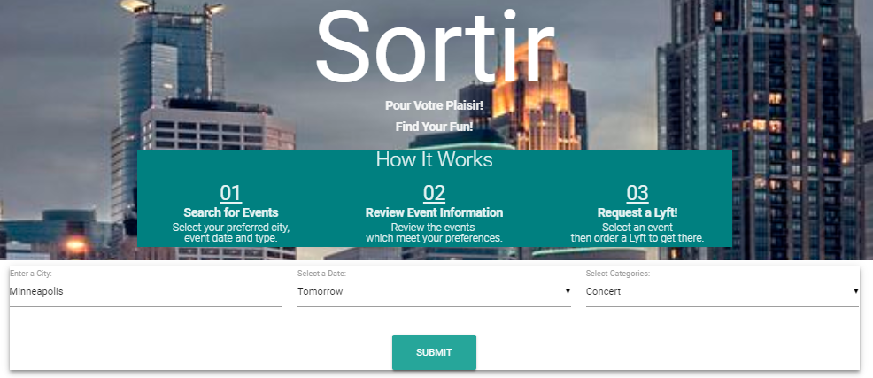
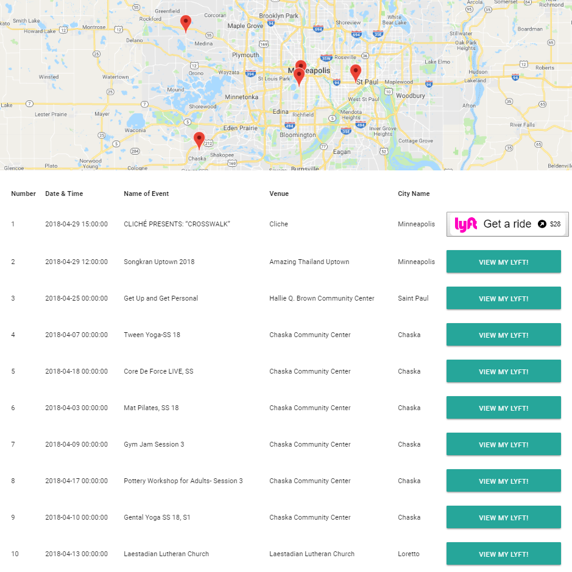

#SORTIR

An app that allows users to enter a city, date and interest category then searches nearby events based on the information entered.

A list of 10 events will display in a table and on the GoogleMaps display.

The user will select one of the events via click causing the Lyft button to display the estimated fare to get to the event as well as the time until a car can arrive to take the user to the event location.

The following APIs were used; Google Map, Eventful and Lyft.

**Accessing the Service**

You can find the service on
[GitHub](https://edudek002.github.io/SortirFinal/)

**User Flow**

1. Enter information about the event you would like to attend: place, date and type of the event

 2. The Google Map will render with the markers.
 You will then be able to see the table with 10 different events in the city you have chosen. After you choose the event you like, you can click on the Lyft button to check the price.

 

